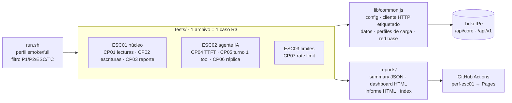

# Arquitectura — ticketpe-qa-perf

Cómo está construido el framework k6. Uso: [`README.md`](README.md) · Estrategia y criterios: [`STRATEGY.md`](STRATEGY.md).

## Vista general

## Capas

| Capa | Responsabilidad | Regla |
|---|---|---|
| `tests/` | Un caso de R3 por archivo: cabecera de trazabilidad, `options` (perfil + umbrales = resultado esperado), flujo | El umbral **es** el resultado esperado de R3: si falla, k6 sale ≠ 0 |
| `lib/common.js` | Todo lo transversal (ver abajo) | Nada de lógica de caso aquí |
| `run.sh` | Ejecuta en orden de archivo (núcleo → agente → saturación), exporta evidencias, agrega criterio de salida | `smoke` antes de `full` |
| `lib/informe.js` | `handleSummary`: veredicto por oráculo, validez, red vs servidor, ruido, borrador R4 → `TC-PERF-0X-<perfil>-informe.html` | Nunca publica claves `*token*` de `setup_data` |
| `reports/` | `TC-PERF-0X-<perfil>.json` (summary), `.html` (dashboard k6), `-informe.html`, `index.html` | No se versiona; en CI se publica en Pages |
| `.github/workflows/perf-esc01.yml` | Matrix TC-PERF-01…03 con `max-parallel: 1` (`fail-fast: false`) + job `publish` (`if: always()`) → `run.sh index` → Pages (https://fmarinoa.github.io/ticketpe-qa-perf/) | Manual (`workflow_dispatch`, input `perfil`), `concurrency: perf`, solo `vars.TEAM` |

## Anatomía de un caso (`tests/escNN-cpNN-<nombre>.js`)

1. **Cabecera de trazabilidad:** TC, escenario, base (R2/R3/AC), tipo CT-PT, condición, precondición, oráculo.
2. **`options`:**
   - `tags`: `tc`, `escenario`, `prioridad`, `severidad` → se propagan a todas las métricas (filtrables en dashboard/salidas).
   - `scenarios`: `loadProfile()` (warm-up + steady, solo TC-PERF-01) o executor propio (`constant-arrival-rate`, `per-vu-iterations`, `constant-vus`) con variante `SMOKE`.
   - `thresholds`: oráculo de R3 + `SUSPENSION` cuando aplica.
3. **`handleSummary = (d) => informe(d, options, título)`** + `summaryTrendStats: STATS` (agrega `count` para detectar métricas sin muestras).
4. **`setup()`:** `exigirEnv()` + `networkBaseline()` + datos (login, eventos).
5. **Flujo:** llamadas vía `api()`/`agente()` con `name` estable por endpoint.

Reglas:
- Con `loadProfile()`, los umbrales de latencia filtran `{scenario:steady}` → el warm-up no cuenta.
- Umbral de conteo (`count>=N` / `count>0`) cuando el oráculo es `max`/`p95` sobre una métrica propia: sin muestras el umbral pasa en vacío.
- Oráculo "cada respuesta < X" (sin percentil) → `max<X`.
- `run.sh` extrae TC y prioridad por `grep` de la cabecera y `prioridad: 'Px'` → deben existir y ser únicos por archivo.

## `lib/common.js`

| Pieza | Qué hace | Base |
|---|---|---|
| `BASE`, `SMOKE`, `ADMIN` | Config desde `__ENV` con defaults | — |
| `TEAM`, `TEAM_TOKEN` | Identidad del equipo desde `__ENV`, **sin fallback**: no se versiona token ni se usan datos de otro equipo | Entorno compartido |
| `exigirEnv(...nombres)` | Criterio de entrada: aborta en `setup()` si falta alguna variable obligatoria (`TEAM` en TC-01/02, `TEAM_TOKEN` en TC-04…07) | Entorno compartido |
| `loadProfile(exec, vus, dur, warmup)` | Escenarios `warmup` (descartado) + `steady` (medido); en smoke 1 VU · 20 s | A-75 |
| `SUSPENSION` | `http_req_failed > 10 %` sostenido aborta la corrida | Criterio de suspensión |
| `api()` | Cliente HTTP con tag `name`, Bearer, `expectedStatuses`, timeout | — |
| `login()`, `registro()`, `eventos()` | Datos de prueba | — |
| `networkBaseline(segundos = 5)` | Trend `red_base_ms`: 1 VU secuencial sobre `GET /api/core/health` durante N s (p50 = `med`). TC-PERF-01 usa 60 s | A-77 · TC-PERF-01 |
| `agente()` | Cliente del agente: reintenta `429` respetando `Retry-After`, cuenta `agente_429_reintentados` (no es muestra de latencia) | — |
| `traza(id)`, `cuota()`, `finalSSE()` | `GET /api/v1/traces/{id}` → `traza` (`totals.tool_calls`, `runtime.replay_mode/replay_miss`) · `GET /api/v1/quota` → `tokens_restantes` · evento `final` del stream SSE | Swagger `/api/openapi.json` |

## Decisiones y limitaciones

- **TTFT por TTFB:** k6 core no lee SSE incremental y `xk6-sse` no está en el registro de k6 2.x. Se aproxima el primer `delta` con `timings.waiting` (cota inferior) y se contrasta con `usage.ttft_ms`. Upgrade: binario xk6 con `xk6-sse` si divergen.
- **Orden de ejecución = nombre de archivo:** ESC01 → ESC02 → ESC03, para que el `429` provocado por TC-PERF-07 no contamine la latencia del agente (TC-PERF-04/05/06).
- **Clase de equivalencia en IA no determinista:** TC-PERF-05 solo cuenta turnos con `traza.totals.tool_calls = 1`; el resto se registra en `turno_fuera_de_clase` (etiqueta `tool_calls`), sin reintentos ni umbral.
- **Contrato 429:** se valida el schema `Error` de Swagger (`error` requerido). `Retry-After` y el tope de 60 rpm aceptadas ya no son umbral (R3 no los pide).
- **Límite en réplica (TC-PERF-07):** k6 no arranca escenarios condicionados al resultado de otro. Si en réplica no hay `429` (`respuestas_429 count>0` falla), se relanza a mano con `REPLAY=off` (70 mensajes en 1 min, IA real).
- **Cuota intacta (TC-PERF-06):** exige `TEAM_TOKEN` propio; con un token compartido la cuota la mueven otros equipos y el oráculo no es falsable.
- **Datos descubiertos, no fijos:** TC-PERF-02 recorre el catálogo en `setup()` y elige el tipo de entrada con más `disponible` (≥ 300, evento futuro, venta abierta). Así sobrevive a resets y a compras de otros equipos; el evento elegido queda en el informe.
