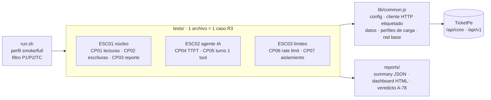

# ticketpe-qa-perf — Framework de rendimiento k6 (R6)

Suite de pruebas de rendimiento de TicketPe para la Testathon 2026 (equipo TesTitans), trazable a R2 §6 y R3 (Tabla 4).
**Estrategia, riesgos, oráculos, criterios de entrada/salida y hallazgos:** [`docs/estrategia-performance.md`](docs/estrategia-performance.md).

## Arquitectura



| Capa | Responsabilidad | Regla |
|---|---|---|
| `tests/` | Un caso de R3 por archivo: cabecera de trazabilidad (TC, AC, tipo CT-PT, condición, oráculo), `options` (perfil + umbrales = resultado esperado), flujo | El umbral **es** el resultado esperado de R3: si falla, k6 sale ≠ 0 |
| `lib/common.js` | Entorno (`__ENV`), cliente `api()` con tag `name` por endpoint, login/registro, perfil `warmup`+`steady` (A-75), red base (A-77), criterio de suspensión, cliente del agente con manejo de `429` | Nada de lógica de caso aquí |
| `run.sh` | Ejecuta en orden de riesgo/aislamiento, exporta evidencias, agrega criterio de salida | `smoke` antes de `full` |
| `reports/` | `TC-PERF-0X-<perfil>.json` (summary), `.html` (dashboard k6), `TC-PERF-04-veredicto.json` | No se versiona |

Etiquetas (`options.tags`) en todas las métricas: `tc`, `escenario`, `prioridad`, `severidad` → filtrables en dashboard/salidas.

## Casos

| Archivo | TC | Prioridad | Condición full |
|---|---|---|---|
| `esc01-cp01-lecturas-catalogo.js` | TC-PERF-01 | P1 | 20 VUs · 5 min · 30 s warm-up |
| `esc01-cp02-escrituras-compra.js` | TC-PERF-02 | P1 | 20 VUs · 5 min · 30 s warm-up |
| `esc01-cp03-reporte-ventas.js` | TC-PERF-07 | P2 | 5 VUs · 3 min · 30 s warm-up |
| `esc02-cp04-ttft-chat.js` | TC-PERF-05 | P1 | 4 VUs · 20 turnos IA real |
| `esc02-cp05-turno-con-herramienta.js` | TC-PERF-06 | P2 | 4 VUs · 20 turnos IA real |
| `esc03-cp06-limite-de-tasa.js` | TC-PERF-03 | P1 | 8 VUs · 2 min |
| `esc03-cp07-aislamiento-equipos.js` | TC-PERF-04 | P1 | 5 VUs línea base 5 min + 5 VUs bajo carga 5 min |

## Uso

```bash
brew install k6                      # k6 >= 2.x
cp .env.example .env                 # TEAM_TOKEN propio para TC-PERF-03/04
./run.sh smoke                       # gate: shakedown 1 VU de toda la suite
./run.sh full p1                     # casos P1 con condición de R3
./run.sh full TC-PERF-07             # un caso
k6 run -e PROFILE=smoke tests/esc01-cp01-lecturas-catalogo.js   # directo
```

Variables: ver `.env.example` (`BASE_URL`, `TEAM`, `TEAM_TOKEN`, `OTRO_TEAM_TOKEN`, `REPLAY`, cuentas `*_EMAIL/*_PASS`).
