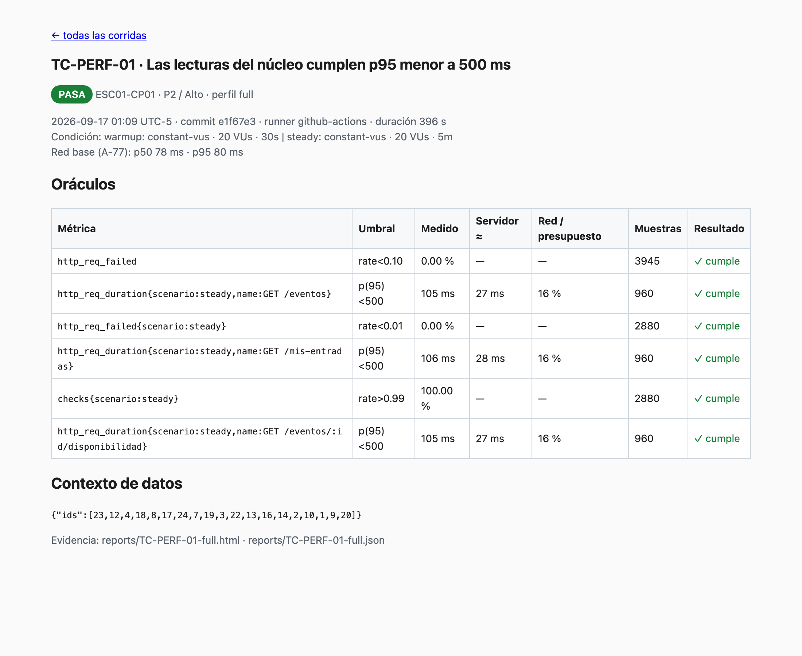
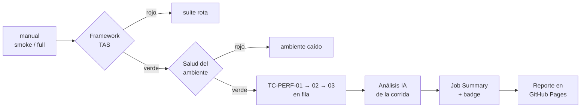
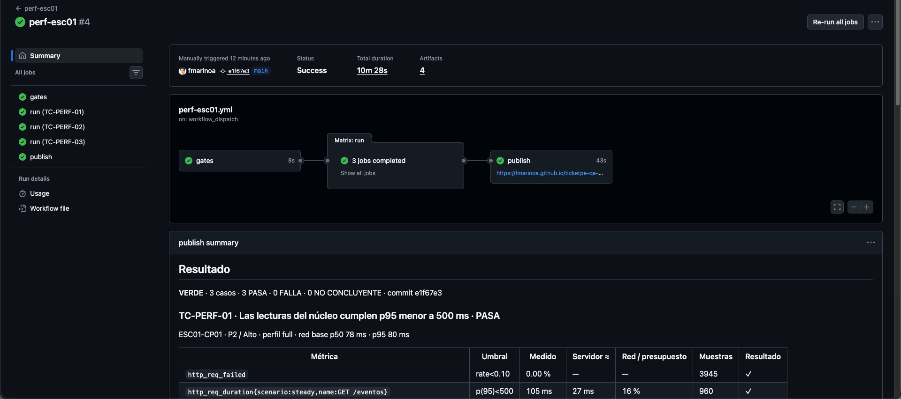
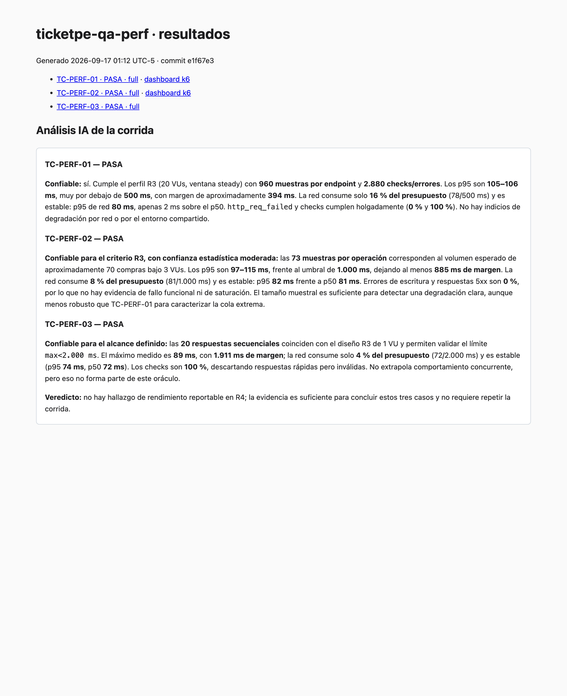

# ticketpe-qa-perf

[](https://fmarinoa.github.io/ticketpe-qa-perf/)

**Suite de rendimiento que responde si TicketPe aguanta la carga donde más duele**: el catálogo que
decide una compra, el pago que mueve dinero y el reporte con el que opera el organizador.
k6 2.2 · GitHub Actions · GitHub Pages · análisis de resultados automático + IA.

Equipo **TesTitans** · Testathon 2026 · entregable R6 (pruebas de rendimiento).

| | |
|---|---|
| 📊 **Reporte en vivo** (última corrida) | https://fmarinoa.github.io/ticketpe-qa-perf/ |
| 🧭 **Casos de origen** (matriz R3) | [`R3-diseno-pruebas/tsv/Performance.tsv`](https://github.com/testingperuoficial/testathon2026/blob/testitans/R3-diseno-pruebas/tsv/Performance.tsv) |
| 🐞 **Defectos encontrados** (R4) | [`R4-ejecucion-reporte-defectos/defectos.md`](https://github.com/testingperuoficial/testathon2026/blob/testitans/R4-ejecucion-reporte-defectos/defectos.md) |
| ⚙️ **Pipeline** | [`.github/workflows/perf-esc01.yml`](.github/workflows/perf-esc01.yml): manual, `smoke` o `full` |

## Resultado

Última corrida `full` en CI (run #4, commit `e1f67e3`, 2026-09-17, runner de GitHub · red base p50 72–81 ms):

| Caso | Condición (R3) | Oráculo | Medido | Servidor ≈ | Veredicto |
|---|---|---|---|---|---|
| TC-PERF-01 lecturas | 20 VUs · 5 min · 960 muestras por endpoint | p95 < 500 ms · error < 1 % | p95 105–106 ms · 0 % error | 27–28 ms | **PASA** |
| TC-PERF-02 escrituras | 3 VUs · 2 min · 73 compras reales | p95 < 1 s · error < 1 % · 0 `5xx` | p95 97–115 ms · 0 % error · 0 `5xx` | 16–34 ms | **PASA** |
| TC-PERF-03 reporte | 1 VU · 20 peticiones | cada respuesta < 2 s | máx 89 ms | 17 ms | **PASA** |

**3/3 PASA, con margen de 4× a 20× sobre el objetivo.** El análisis IA lo confirma como evidencia confiable
(muestras suficientes, red estable) y **sin hallazgo de rendimiento para R4** en ESC01. Duración total del pipeline: ~10 min.

El oráculo es la matriz R3: **el umbral de k6 es el resultado esperado**, no se ajusta para pasar.
Un umbral incumplido se reporta en R4 con la evidencia que deja la corrida (informe, dashboard k6, JSON).



## Qué riesgos cubre

No se mide todo el API: se mide **donde la lentitud cuesta ventas, dinero u operación** (RSK-22, [`STRATEGY.md`](STRATEGY.md) §3).

| Riesgo de negocio | Qué se prueba | Condición (R3) | Oráculo | Severidad |
|---|---|---|---|---|
| **Abandono de compra** | catálogo, disponibilidad y "mis entradas" bajo carga | 20 VUs · 5 min · 30 s warm-up | p95 < 500 ms por endpoint · error < 1 % | Alto |
| **Dinero** | reserva → pago → check-in con cupo real | 3 VUs · 2 min · 1 compra / 5 s por VU | p95 < 1 s por endpoint · error < 1 % · 0 `5xx` | Alto |
| **Operación del organizador** | reporte de ventas del evento con más ventas | 1 VU · 20 peticiones | cada respuesta < 2 s | Medio |

ESC02 (agente IA) y ESC03 (límite de tasa) están implementados ([casos](#casos)) pero **fuera del pipeline a propósito**:
el token del agente es único para los 22 equipos y saturarlo degrada a todos.

## Cómo trabaja el pipeline





**Un rojo ya dice de quién es el problema**, antes de abrir un log:

| Step en rojo | Significa | Lo arregla |
|---|---|---|
| Verificar el framework (TAS) | la automatización o el análisis están rotos | QA performance |
| Gate de salud del ambiente | `/api/core/health` no responde sano: **no se genera carga** | infraestructura |
| `Criterio de entrada: …` | falta una variable o no hay evento con cupo | quien lanzó la corrida |
| Ejecutar TC-PERF-0X | umbral de R3 incumplido: hallazgo candidato | desarrollo, tras el triage |

Los casos corren **en fila** (`max-parallel: 1`): en paralelo, la carga de uno contaminaría la medición del otro.
Nunca hay dos corridas a la vez (`concurrency: perf`) sobre el entorno compartido.

### Análisis automático de resultados

Cada caso escribe su propio informe al terminar (`handleSummary` → [`lib/informe.js`](lib/informe.js)), sin pasos manuales.
Veredicto por caso:

| Veredicto | Cuándo | Qué hacer |
|---|---|---|
| **PASA** | todos los umbrales de R3 se cumplen, con muestras, en perfil `full` | evidencia válida del caso |
| **FALLA** | al menos un umbral se incumple (con o sin muestras suficientes) | triage → hallazgo R4 o repetir |
| **NO CONCLUYENTE** | ningún umbral falla, pero la corrida **no prueba** el oráculo: perfil `smoke` (1 VU, no es la condición de R3) o algún umbral sin muestras (en k6 un p95 sin datos vale 0 y "pasa") | no usar como evidencia: corregir la causa y correr `full` |

| Regla adicional | Qué evita |
|---|---|
| *Servidor ≈* latencia − p50 de red base · % del presupuesto que consume la red | culpar al backend por la red del runner |
| p95/p50 de red base > 1.5 ⇒ aviso de red inestable | concluir con una corrida contaminada |
| Borrador de bug R4 si hay FALLA | reescribir la evidencia a mano |

### Análisis IA de la corrida

En **toda** corrida, pase o falle, [`scripts/analizar-corrida.sh`](scripts/analizar-corrida.sh) pasa los resúmenes a
**GitHub Copilot CLI**, que puede leer los scripts y la estrategia. Resultado en el Job Summary y en Pages:

1. **PASA:** ¿es confiable? (muestras, margen contra el umbral, estabilidad de la red)
2. **NO CONCLUYENTE:** por qué y qué falta para concluir
3. **FALLA:** causa probable y clasificación `SUT_LENTO` · `RED` · `DATOS` · `AMBIENTE` · `TAS` · `RUIDO_COMPARTIDO`
4. Veredicto: ¿hay hallazgo reportable en R4 o hay que repetir?

La IA sugiere, no bloquea (`continue-on-error`): la decisión de reportar es humana.



## Ingeniería de la suite

Detalle en [`STRATEGY.md`](STRATEGY.md) §13 (vocabulario ISTQB CT-PT y CTAL-TAE):

- **Se prueba el análisis, no solo el producto.** [`framework/informe.test.js`](framework/informe.test.js) verifica sin red
  que el veredicto no invente un PASA ni esconda un FALLA: un bug del TAS no se disfraza de bug del API.
- **El umbral es el resultado esperado de R3.** Trazabilidad TC → condición de carga → `thresholds` → informe.
- **Cero datos quemados.** TC-PERF-02 elige en cada corrida el evento futuro con más cupo; TC-PERF-01 registra un
  asistente por VU. Un reset de semilla o las compras de otros equipos no rompen la suite.
- **Warm-up descartado** (TC-PERF-01): los umbrales solo miran la ventana estable.
- **Red separada del servidor.** Red base medida en cada corrida (1 min en TC-PERF-01).
- **Buen vecino en un entorno compartido.** Criterio de suspensión (> 10 % de error aborta), gate de salud, smoke antes
  de full, casos en fila, sin soak ni spike.
- **Sin fallbacks ni secretos.** `TEAM` obligatoria; el informe publicado filtra cualquier `*token*`; ESC01 no usa secrets.
- **Seguridad del pipeline.** Actions fijadas por hash de commit (última versión estable).

## Ejecutar

Requisito: **k6 ≥ 2.2** (`brew install k6`).

```bash
cp .env.example .env                 # TEAM (ESC01) y TEAM_TOKEN (ESC02/03), sin fallback
./run.sh smoke esc01                 # gate: shakedown 1 VU del núcleo
./run.sh full esc01                  # condición de carga de R3
./run.sh full TC-PERF-02             # un caso
./run.sh index                       # regenera reports/index.html, badge.json y resumen.md
scripts/analizar-corrida.sh          # análisis IA local (requiere Copilot CLI)
k6 run framework/informe.test.js     # verificación del TAS, sin red
k6 run framework/salud.js            # gate de salud del ambiente
```

En CI:

```bash
gh workflow run perf-esc01 -f perfil=smoke   # ≈ 3–4 min
gh workflow run perf-esc01 -f perfil=full    # ≈ 11–13 min
gh run watch
```

<details>
<summary><b>Variables</b></summary>

| Variable | Obligatoria | Casos | Por defecto |
|---|---|---|---|
| `TEAM` | Sí | TC-PERF-01, 02 (prefijo `perf-<TEAM>-…` de las cuentas creadas) | — (el `setup()` aborta) |
| `TEAM_TOKEN` | Sí | TC-PERF-04…07 (token del agente; hoy el compartido del README de la Testathon) | — (el `setup()` aborta) |
| `BASE_URL` | No | Todos | `https://testathon.testingperu.com` |
| `ADMIN_EMAIL` / `ADMIN_PASS` | No | TC-PERF-02 (check-in), 03 (reporte) | cuenta admin pública |
| `REPLAY` | No | TC-PERF-07 (`off` = IA real) | réplica |
| `PROFILE`, `GIT_SHA`, `RUNNER` | No | Todos | los define `run.sh` |

En CI solo existe la variable de repo `TEAM=testitans`, sin secrets.

</details>

<details>
<summary><b>CI y Pages</b></summary>

| Aspecto | Configuración |
|---|---|
| Jobs | `gates` (TAS + salud) → `run` (matrix TC-PERF-01…03, `max-parallel: 1`, `fail-fast: false`, 15 min por job) → `publish` (`if: always()`) |
| Evidencias | Artifact `reports-TC-PERF-0X` por caso, 14 días |
| Publicación | `index.html`, informes, dashboards k6, `badge.json` y análisis IA en https://fmarinoa.github.io/ticketpe-qa-perf/ · solo la última corrida |
| Pages | Origen *GitHub Actions*, entorno `github-pages`. **Sitio público** aunque el repo sea privado |
| Punto de medición | Runner de GitHub (EE. UU.): la red base difiere de Lima; no comparar corridas de runners distintos |

</details>

<details>
<summary><b>Estructura</b></summary>

```
tests/                                  un caso de la matriz R3 por archivo
  esc01-cp01-lecturas-catalogo.js       TC-PERF-01
  esc01-cp02-escrituras-compra.js       TC-PERF-02
  esc01-cp03-reporte-ventas.js          TC-PERF-03
  esc02-cp04..06-*.js                   TC-PERF-04..06 (agente, fuera de CI)
  esc03-cp07-limite-de-tasa.js          TC-PERF-07 (fuera de CI)
lib/
  common.js                             entorno, cliente HTTP etiquetado, datos, perfiles, red base
  informe.js                            análisis automático (handleSummary)
framework/
  informe.test.js                       verificación del TAS, sin red
  salud.js                              gate de salud del ambiente
scripts/analizar-corrida.sh             análisis IA de la corrida
run.sh                                  runner local y de CI, índice, badge y resumen
```

</details>

## Casos

| Archivo | TC | Prioridad / Severidad | Condición full | En CI |
|---|---|---|---|---|
| `esc01-cp01-lecturas-catalogo.js` | TC-PERF-01 | P2 / Alto | 20 VUs · 5 min · 30 s warm-up · red base 1 min | ✅ |
| `esc01-cp02-escrituras-compra.js` | TC-PERF-02 | P2 / Alto | 3 VUs · 2 min · 1 compra cada 5 s por VU | ✅ |
| `esc01-cp03-reporte-ventas.js` | TC-PERF-03 | P2 / Medio | 1 VU · 20 peticiones secuenciales | ✅ |
| `esc02-cp04-ttft-chat.js` | TC-PERF-04 | P2 / Medio | 1 VU · 10 turnos IA real (stream) | — |
| `esc02-cp05-turno-con-herramienta.js` | TC-PERF-05 | P2 / Medio | 1 VU · 20 turnos IA real | — |
| `esc02-cp06-modo-replica.js` | TC-PERF-06 | P2 / Bajo | 1 VU · 20 turnos réplica | — |
| `esc03-cp07-limite-de-tasa.js` | TC-PERF-07 | P2 / Alto | 8 VUs concurrentes · 90 s réplica (`REPLAY=off`: 70 mensajes en 1 min) | — |

## Documentación

| Documento | Qué responde |
|---|---|
| [`STRATEGY.md`](STRATEGY.md) | qué se mide, con qué oráculo y criterios; ingeniería del TAS (§13) |
| [`ARCHITECTURE.md`](ARCHITECTURE.md) | cómo está armada la suite y por qué |
